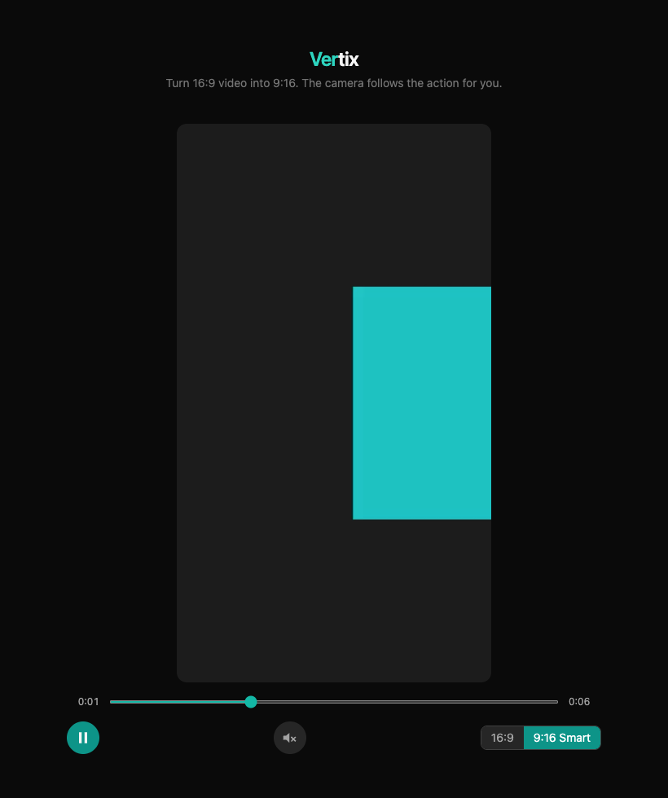

# Vertix

Turn a 16:9 video into 9:16, right in your browser. Vertix does not just cut
the middle of the frame. It looks for faces, works out who is speaking, and
moves a "virtual camera" to keep that person in view — with a smooth pan,
not a hard jump. If no face is there, it falls back to tracking whatever is
most active in the frame. Nothing is uploaded. Everything runs on your
machine.



*The smart crop (teal box) follows the subject and stays offset from
center — a plain center-crop would have cut it in half.*

## Why

A simple center-crop often cuts off the person who matters most, especially
when more than one person is on screen. Doing this well needs three things:
a way to *find* faces, a way to work out *who is talking*, and a way to
*move* the crop there without shaking or jumping.

- **Finding faces** needs a real face detector, not a guess based on color
  or brightness. Vertix runs a small pretrained model
  ([UltraFace](https://github.com/Linzaer/Ultra-Light-Fast-Generic-Face-Detector-1MB),
  MIT license, ~1.2MB) in Rust compiled to WebAssembly (WASM) — this is not
  a model Vertix trained itself, just a good small one reused as-is.
- **Picking the speaker**, when more than one face is on screen, uses a
  simple trick: the mouth area that changes the most between frames is
  probably the one talking. No audio needed.
- **When there's no face** (b-roll, sports action, product shots), Vertix
  falls back to a lighter heuristic: texture, contrast, skin tone, and
  motion, biased toward the center of the frame.
- **Moving smoothly** needs a control loop, not a straight jump to the
  target. Vertix uses a PID controller (the same idea used to keep a drone
  steady) to slide the crop window toward the target a little at a time.

Running a face detector on every single frame is too slow for real-time
video, so Vertix only re-detects a few times per second and lets the PID
controller smooth the motion in between. The full-resolution crop is drawn
straight from the video with the GPU — no manual pixel copying for the
final frame.

## Features

- **Face-aware reframing** — a real face-detection model (not a guess)
  finds people, and a mouth-motion check picks out who's speaking.
- **Graceful fallback** — no face on screen? Vertix tracks motion and
  contrast instead, so b-roll and action shots still get a sensible crop.
- **Smooth camera motion** — a PID controller with a small dead zone, so the
  crop never jitters on noise or jump-cuts on a sudden change.
- **Four views** — the original 16:9; a tight 9:16 "Smart" crop; a "Wide"
  crop that tracks the same way but shows more headroom around the subject
  (padded top/bottom with a blurred backdrop, since a wider crop needs more
  height than the source actually has); and a "Fit" view that shows the
  whole frame with a blurred backdrop instead of cropping or black bars.
  Switch at any time, even mid-playback.
- **Load any local video** — drag and drop a file, or click to choose one.
  Nothing leaves your browser.

## Project Structure

```
.
├── index.html              # Vite entry point
├── vite.config.ts
├── tsconfig.json
├── tailwind.config.js
├── src/
│   ├── main.tsx             # React entry point
│   ├── App.tsx              # Layout, file loading, player state
│   ├── components/Player/
│   │   ├── Canvas.tsx         # <canvas> the video is drawn into
│   │   ├── Controls.tsx       # Play/pause, mute, mode toggle
│   │   └── Timeline.tsx       # Scrub bar
│   ├── hooks/
│   │   └── useWasmReframe.ts  # Loads WASM, runs the per-frame render loop
│   └── wasm/                # Generated bindings (wasm-pack output, gitignored)
│       ├── wasm.js
│       ├── wasm.d.ts
│       └── wasm_bg.wasm
├── wasm/
│   ├── Cargo.toml
│   └── src/
│       ├── lib.rs             # ReframeEngine: fallback saliency + PID smoothing
│       ├── face.rs            # Face detection, filtering, speaker selection
│       └── models/
│           ├── ultraface-slim-320.onnx  # Pretrained face detector (MIT)
│           └── ATTRIBUTION.md
└── docs/
    └── screenshot.png
```

## Prerequisites

- [Node.js](https://nodejs.org/) 20 or newer
- [Rust](https://rustup.rs/) stable
- [wasm-pack](https://rustwasm.github.io/wasm-pack/installer/) —
  `cargo install wasm-pack`

## Getting Started

```bash
npm install
npm run wasm:build   # compiles wasm/ and writes bindings to src/wasm/
npm run dev          # starts the Vite dev server (http://localhost:5173)
```

`src/wasm/` is generated and gitignored — run `npm run wasm:build` again
after cloning, or after changing anything in `wasm/src/`.

The face-detection model is bundled into the WASM file, so it's a few MB
(around 5MB, ~2MB gzipped) instead of a few KB. That's the trade-off for
running real face detection fully in the browser instead of a much smaller,
cruder color-based guess.

## Scripts

| Command             | Description                                           |
| -------------------- | ------------------------------------------------------ |
| `npm run dev`        | Start the Vite dev server with hot reload               |
| `npm run build`      | Type-check, then build for production into `dist/`      |
| `npm run preview`    | Serve the production build locally                      |
| `npm run wasm:build` | Rebuild the Rust crate with `wasm-pack`                  |

## How It Works

1. `useWasmReframe` loads the WASM module once, then drives the render loop
   with `requestVideoFrameCallback` — this runs in sync with each decoded
   video frame, on the main thread, so audio and video never drift apart.
2. On every frame, a small (320×180) copy is drawn to a hidden canvas and
   read back as pixels, then passed to `ReframeEngine.process_frame` (Rust).
3. A few times per second (not every frame — the model is too slow for
   that), a second small (320×240) copy is passed to
   `ReframeEngine.update_face_target`. This runs the face-detection model,
   removes overlapping boxes, throws out boxes that don't look like skin
   (this is what stops it from "seeing a face" in a teapot or a bottle), and
   picks whichever remaining face has the most mouth motion.
4. `process_frame` uses that face position as the crop target if one was
   found recently. If not — or if there's no face at all — it falls back to
   scoring the small frame on texture, contrast, skin tone, and motion, with
   a bias toward the center and upper third of the frame.
5. Either way, a PID controller smooths the target into a slow, steady pan,
   clamped so the crop window never crosses the frame edges. The final crop
   is drawn straight from the original `<video>` element at full
   resolution, not from the small analysis copy.
6. Switching modes or seeking resets the engine, so the camera doesn't try
   to smoothly pan across a jump in time.

## Rebuilding the WASM Module

If you change `wasm/src/lib.rs`:

```bash
npm run wasm:build
```

This runs `wasm-pack build --target web` and writes the bindings to
`src/wasm/`, which Vite bundles like any other asset.

## License

MIT — see [LICENSE](LICENSE). The bundled face-detection model
([UltraFace](https://github.com/Linzaer/Ultra-Light-Fast-Generic-Face-Detector-1MB))
is also MIT-licensed; see
[wasm/src/models/ATTRIBUTION.md](wasm/src/models/ATTRIBUTION.md).
