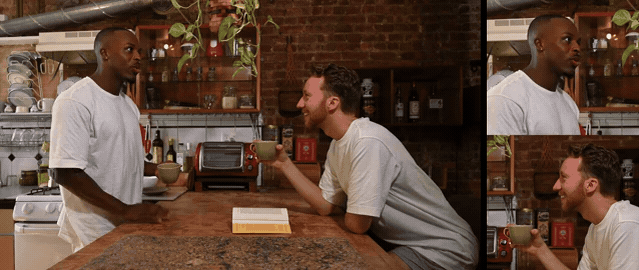

# Vertix

[](https://pzanella.github.io/vertix/)

Turn a 16:9 video into 9:16, right in your browser. Vertix finds faces,
works out how many speakers are on screen, and frames each one — a single
speaker gets a comfortable chest-up crop, two speakers get a stacked
split-screen, three or more get a grid. When no face is visible (a cutaway,
b-roll, an establishing shot), it shows the full frame instead of guessing
a crop. Nothing is uploaded. Everything runs on your machine.



*Composited with Vertix's own crop math (zoom factor, rule-of-thirds anchor)
on the [`2-speakers-c.mp4`](#sample-clips) sample clip, sourced from
[Pexels](https://www.pexels.com/).*

## Why

A simple center-crop often cuts off the person who matters most, especially
with more than one person on screen. And footage with nobody in it at all
(a cutaway, an establishing shot) shouldn't be cropped by guesswork; it's
better left alone. Getting this right comes down to four smaller problems,
solved in order: find the faces, work out how many of them are actual
speakers, lay out however many there are, and move the crop smoothly
instead of jittering on every small gesture.

**Finding faces** takes a real detector, not a guess based on color or
brightness. Vertix runs a small pretrained model
([UltraFace](https://github.com/Linzaer/Ultra-Light-Fast-Generic-Face-Detector-1MB),
MIT license, ~1.2MB) in Rust compiled to WebAssembly. It's a good small
model reused as-is, not one Vertix trained itself.

**Counting speakers** means filtering out background people. A face has to
be reasonably large and mostly inside the frame to count; someone far away
in a crowd, or half cut off at the edge, doesn't.

**Laying out** *N* speakers follows a simple rule. One fills the whole
9:16 frame. Two stack top and bottom. Three or more form a grid. Zero
means no crop at all, rather than a guess at what's interesting.

**Moving the crop** relies on a dead zone that ignores small, ordinary
movement, plus a gentle glide toward any position that drifts far enough
to matter. The result holds still through normal head and body motion
instead of constantly micro-adjusting.

Running a face detector on every single frame is too slow for real-time
video, so Vertix only re-detects a few times a second. The crop itself is
still drawn straight from the video at full resolution on the GPU, with no
manual pixel copying.

## Features

- **Face-aware, speaker-count-aware reframing** — a real face-detection
  model finds people; size and visibility checks decide which of them
  count as an actual on-camera speaker.
- **Multi-speaker layouts** — 1 speaker gets a chest-up crop, 2 stack
  top/bottom, 3+ form a grid, updated automatically as people enter or
  leave frame.
- **B-roll fallback** — 0 speakers on screen means the full frame is shown,
  uncropped, instead of a guessed-at crop.
- **Stable camera** — a dead zone plus smoothing means the crop only moves
  for a real, intentional reposition, not every small gesture.
- **Smooth transitions** — layout changes (single → split → b-roll, ...)
  cross-dissolve instead of cutting instantly.
- **Live analytics dashboard** — FPS, detection confidence, motion
  activity, render latency, detection-worker latency, and main-thread
  stalls, each with a live trend chart.
- **Two views** — the original 16:9, or the reframed 9:16 — toggle at any
  time, even mid-playback.
- **Three ways to load a video** — drag and drop a local file (nothing
  leaves your browser), paste a direct video URL (MP4/WebM/Ogg), or paste
  an adaptive stream URL (HLS/DASH), all through [Shaka
  Player](https://github.com/shaka-project/shaka-player). No footage
  handy? Pick one of the six built-in [sample clips](#sample-clips) right
  from the app.
- **Live network telemetry** — for URL and stream sources, buffer health,
  estimated bandwidth, dropped/decoded frames, the active ABR variant,
  bytes downloaded, stalls, and quality switches, behind a button
  overlaid on the video itself.
- **Switch sources anytime** — a "Change source" control in the header
  drops back to the picker without a page reload.
- **Responsive layout** — works down to a phone-sized screen, with the
  analytics panel moving above the video and tucking away behind a toggle.

## Architecture

The reframing logic and the web app around it are two separate things:

- **`src/core/`** is the reframe engine — face detection, the
  multi-speaker layout decision, smoothing, and the canvas render loop.
  It has **zero dependency on React** (or any UI framework): it's plain
  TypeScript that reads frames from an `HTMLVideoElement` and draws to an
  `HTMLCanvasElement`. It's written this way on purpose, so it can
  eventually ship as its own package and drop into any video player —
  including ones managed by something like Shaka Player or hls.js. See
  [`src/core/README.md`](src/core/README.md) for the engine's own API, and
  [`docs/player-integration.md`](docs/player-integration.md) for a worked
  integration example.
- **`src/hooks/useWasmReframe.ts`** is a thin React adapter around the
  engine. It owns everything specific to *this app's* playback UI —
  loading a source (local file, direct URL, or HLS/DASH stream) via a
  [Shaka Player](https://github.com/shaka-project/shaka-player) instance,
  play/pause/seek, mute, the scrub bar — and mirrors both the engine's and
  Shaka's own state into React state for the components to render. The
  engine itself never knows Shaka exists; see
  [`docs/player-integration.md`](docs/player-integration.md).
- **`src/App.tsx`** and **`src/components/Player/`** are the actual UI:
  the source picker (upload / sample / URL), the canvas (with the network
  telemetry overlay on top of it), the transport bar, the live status
  badge, and the analytics dashboard with its trend charts.

Changing how the reframing decides what to show happens in `src/core/`.
Changing how the app looks or behaves as a web page happens in
`src/hooks/` or `src/components/`.

Face detection (the one genuinely expensive step in the pipeline) — both
the WASM inference and the pixel readback that feeds it — normally runs in
a Worker (`src/core/faceDetectionWorker.ts`, pre-bundled by
`npm run build:worker`), falling back to the main thread if the worker
doesn't prove itself ready in time. See [Known Limitations](#known-limitations)
for how that ended up taking a few attempts, and what's still unconfirmed
about this one.

## Project Structure

```
.
├── index.html                    # Vite entry point
├── vite.config.ts
├── tsconfig.json
├── tailwind.config.js
├── public/
│   ├── favicon.svg
│   ├── samples/                    # Sample clips, served as static assets (see Sample Clips below)
│   │   └── posters/                  # Poster thumbnails for the sample picker
│   └── workers/                    # Generated by `npm run build:worker` (esbuild), gitignored
├── scripts/
│   └── build-worker.mjs            # Pre-bundles faceDetectionWorker.ts to public/workers/
├── src/
│   ├── main.tsx                    # React entry point
│   ├── App.tsx                     # Layout, file loading, player state
│   ├── core/                       # Framework-agnostic reframe engine (see src/core/README.md)
│   │   ├── VertixEngine.ts           # Detection loop, layout decisions, canvas rendering
│   │   ├── layoutEngine.ts           # Pure layout math: crop rects, dead zone, smoothing
│   │   ├── faceDetectionWorker.ts     # Runs WASM inference + pixel readback off the main thread
│   │   ├── audioActivity.ts          # Voice-activity signal from the video's own audio track
│   │   ├── index.ts                  # Public exports
│   │   └── wasm/                     # Generated bindings (wasm-pack output, gitignored)
│   │       ├── wasm.js
│   │       ├── wasm.d.ts
│   │       └── wasm_bg.wasm
│   ├── hooks/
│   │   └── useWasmReframe.ts       # Thin React adapter: VertixEngine + Shaka Player
│   └── components/Player/
│       ├── Canvas.tsx                 # <canvas> the video is drawn into, with an overlay slot
│       ├── Controls.tsx               # Play/pause/replay, mute, mode toggle, scrub bar
│       ├── Timeline.tsx               # Scrub bar (rendered inside Controls)
│       ├── LiveStatusPanel.tsx        # Small "Status: ..." badge
│       ├── SourceTabs.tsx             # Upload / Sample / URL source picker tabs
│       ├── SamplePicker.tsx           # Sample-clip card grid, with poster thumbnails
│       ├── UrlSourceInput.tsx         # Direct video / HLS / DASH URL input
│       ├── AnalyticsDashboard.tsx     # Live metrics sidebar panel
│       ├── LiveAnalyticsCharts.tsx    # Sparkline trend charts
│       ├── StreamHealthOverlay.tsx    # Network-telemetry button+panel overlaid on the video
│       ├── dashboardPrimitives.tsx    # Shared Section/Row components
│       └── dashboardFormat.ts         # Shared formatting/tone helpers
├── wasm/
│   ├── Cargo.toml
│   └── src/
│       ├── lib.rs                  # ReframeEngine: WASM entry points
│       ├── face.rs                 # Face detection, filtering, scoring
│       └── models/
│           ├── ultraface-slim-320.onnx  # Pretrained face detector (MIT)
│           └── ATTRIBUTION.md
└── docs/
    ├── architecture-pipeline.svg  # Diagram: frame processing pipeline
    └── player-integration.md      # How to attach the engine to Shaka Player / hls.js / Video.js
```

## Prerequisites

- [Node.js](https://nodejs.org/) 20 or newer
- [Rust](https://rustup.rs/) stable
- [wasm-pack](https://rustwasm.github.io/wasm-pack/installer/) —
  `cargo install wasm-pack`

## Getting Started

```bash
npm install
npm run build:wasm    # compiles wasm/ and writes bindings to src/core/wasm/
npm run build:worker  # bundles the face-detection worker to public/workers/
npm run dev           # starts the Vite dev server (http://localhost:5173)
```

`src/core/wasm/` and `public/workers/` are both generated and gitignored —
re-run `npm run build:wasm` after cloning or after changing anything in
`wasm/src/`, and `npm run build:worker` after that (it needs
`src/core/wasm/` to already exist) or after changing
`src/core/faceDetectionWorker.ts`. `npm run build` runs `build:worker`
automatically; `npm run dev` doesn't, the same as it doesn't re-run
`build:wasm` automatically either.

The face-detection model is bundled into the WASM file, so it's a few MB
(around 5MB, ~2MB gzipped) instead of a few KB. That's the trade-off for
running real face detection fully in the browser instead of a much smaller,
cruder color-based guess.

## Sample Clips

`public/samples/` has six short clips so you can try Vertix without
hunting for your own footage, shown as a card grid (with poster
thumbnails from `public/samples/posters/`) on the Sample tab of the
source picker:

| File                 | Speakers | Audio | Duration |
| --------------------- | :------: | :---: | -------: |
| `1-speaker.mp4`       | 1        | no    | ~35s     |
| `2-speakers-a.mp4`    | 2        | yes   | ~16s     |
| `2-speakers-b.mp4`    | 2        | no    | ~10s     |
| `2-speakers-c.mp4`    | 2        | no    | ~10s     |
| `2-speakers-d.mp4`    | 2        | no    | ~8s      |
| `3-speakers.mp4`      | 3        | yes   | ~12s     |

`1-speaker.mp4` exercises the single chest-up crop, the four `2-speakers-*`
clips exercise the stacked split (and are the best set for testing the
b-roll/split debounce on cuts), and `3-speakers.mp4` exercises the grid
layout. They're served straight from `public/`, so they also work as-is
once the app is deployed — no separate hosting needed.

Sourced from [Pexels](https://www.pexels.com/), free to use under the
[Pexels License](https://www.pexels.com/license/).

## Scripts

| Command               | Description                                          |
| ---------------------- | ----------------------------------------------------- |
| `npm run dev`          | Start the Vite dev server with hot reload              |
| `npm run build`        | Type-check, then build for production into `dist/`     |
| `npm run preview`      | Serve the production build locally                     |
| `npm run build:wasm`   | Rebuild the Rust crate with `wasm-pack`                 |
| `npm run build:worker` | Rebuild the face-detection worker bundle with esbuild   |

## How It Works


1. `VertixEngine.attach(video, canvas)` starts a render loop driven by
   `requestVideoFrameCallback`, running in sync with each decoded video
   frame on the main thread so audio and video never drift apart. The
   engine never touches the video's own playback (`.play()`, `.src`,
   `.currentTime`); it only reads frames and reacts to the element's own
   `play`/`seeking`/`loadedmetadata` events. Whatever's driving playback,
   whether this app's own controls or a media framework like Shaka Player,
   stays in full control.
2. Every few frames, a small (320×240) copy of the current frame is drawn
   to a hidden canvas, read back as pixels, and handed to the WASM face
   detector (`ReframeEngine.update_faces`, in `wasm/src/`) — normally in a
   dedicated Worker, with only the result (not this thread) waited on; a
   main-thread fallback exists if the worker doesn't check in ready in
   time. This runs the UltraFace model, removes overlapping boxes, and
   returns every detected face's position, size, and a couple of extra
   signals (how much the mouth area is moving, the model's own
   confidence).
3. Detected faces are filtered in `src/core/VertixEngine.ts`: a face has
   to be a reasonable size and mostly inside the frame to count as an
   actual on-camera speaker (this is what keeps a stadium full of distant
   fans from being read as "50 speakers").
4. `src/core/layoutEngine.ts` turns the surviving face count into a
   layout: 0 → no crop; 1 → a single wide, chest-up crop; 2 → stacked
   panes; 3+ → a grid. This only re-runs when the face *count* changes —
   not on every detection tick — and only takes effect once that count has
   held steady for a few ticks, so a single misdetection doesn't flip the
   layout and back.
5. Within a stable layout, each pane's crop position only moves once its
   face has drifted past a small dead zone (ordinary gestures are ignored
   completely), and then glides toward the new position instead of
   snapping.
6. When the layout itself changes, the engine cross-dissolves from the old
   framing into the new one instead of cutting instantly.

## Known Limitations

**Face detection runs in a Worker**, shared across every `VertixEngine`
instance on the page. The main thread only resizes the frame to the
detector's input size via `createImageBitmap()` (browser-internal, doesn't
block JS) and hands the result over — even the pixel readback
(`drawImage`+`getImageData`) that used to run on the main thread now
happens inside the worker. Falls back to running both synchronously on the
main thread if the worker can't be built, errors, or doesn't report ready
within `WORKER_READY_TIMEOUT_MS` (4s) — and that fallback isn't just a
startup check: a crash discovered well after the worker reported ready
(not just an initial-load failure) is recovered from the same way, via
`getSharedDetectionWorker`'s `fail()`.

Getting there took a few rounds. Vite's own worker-bundling hung
indefinitely with no error for this specific file — fixed by pre-bundling
the worker with esbuild instead (`scripts/build-worker.mjs`, served as a
plain static file). After that, the worker still hung, but only when
created from the app's own code — never from a manual console call. Turned
out React StrictMode constructs two `VertixEngine`s per mount, and two
near-simultaneous `new Worker()` calls against the same script reliably
left one of them stuck forever. Fixed by making the worker a page-level
singleton (`getSharedDetectionWorker()`) instead of one per instance.

**Rapid layout changes could tear a frame**, found on chaotic press-scrum
footage: a second layout change landing mid-fade would snapshot an
already-blended frame instead of a clean one, compounding into visibly
torn panes. Fixed by cutting cleanly to the new layout instead of starting
a second fade on top of an unfinished one.

**Active-speaker resolution.** Once 3 or more faces are detected, a plain
grid isn't trustworthy on its own — a press-scrum bystander or a reporter
holding a mic into frame reads the same as a genuine multi-person
conversation. The engine tries to lock onto a single active speaker: first
by who's clearly the largest face in frame (works without audio), then by
mouth motion if sizes are too close to call. Below `AMBIGUOUS_GRID_FALLBACK_FACES`
(3), an unresolved scene falls back to the ordinary grid rather than
guessing wrong; above it, to no crop at all. Neither signal is a trained
model — framing size and mouth motion are proxies, not ground truth, and a
large-but-silent bystander or an animated talker can still fool it.

This was tried at 2 faces as well and reverted: on a real interview clip,
the size check locked onto a reporter's mic-holding arm/shoulder (facing
away from camera) instead of the actual on-camera subject, and held the
crop there — facing away, subject not shown — for several seconds before
anything else won by enough margin to take the lock back. At 2 faces, a
plain split at least always keeps the real subject visible in their own
pane; a confidently-wrong single-speaker lock is strictly worse than that
trade, so this now only runs at 3+, matching the range it was originally
validated against. The same failure mode is still structurally possible
at 3+ — it just hasn't been observed there yet.

**Voice-activity detection depends on the `<video>`'s own audio track**
(`src/core/audioActivity.ts`), and degrades to "unavailable" — never
throws — if there's no audio track, the browser blocks `AudioContext`
before a user gesture, or the source is muted (every video loads muted by
default, so this is the common case until a viewer unmutes). Cross-origin
sources also read as silence unless the `<video>` element is marked
`crossOrigin="anonymous"`, which this app now sets for HLS/DASH sources
specifically (not plain progressive URLs, where an untested CORS setup
could break loading altogether). This is exactly why the size-based check
above doesn't need audio to work at all.

**Testing this live needs an actual foregrounded browser tab.** A `<video>`
fed through Shaka's `player.attach()` never fires `MediaSource`'s
`sourceopen` while the tab is backgrounded, independent of network, CORS,
or focus — so real playback can only be verified by hand, not through this
project's own browser-automation tooling.

## Rebuilding the WASM Module

If you change anything in `wasm/src/`:

```bash
npm run build:wasm
```

This runs `wasm-pack build --target web` and writes the bindings to
`src/core/wasm/`, which Vite bundles like any other asset.

## License

MIT — see [LICENSE](LICENSE). The bundled face-detection model
([UltraFace](https://github.com/Linzaer/Ultra-Light-Fast-Generic-Face-Detector-1MB))
is also MIT-licensed; see
[wasm/src/models/ATTRIBUTION.md](wasm/src/models/ATTRIBUTION.md).
